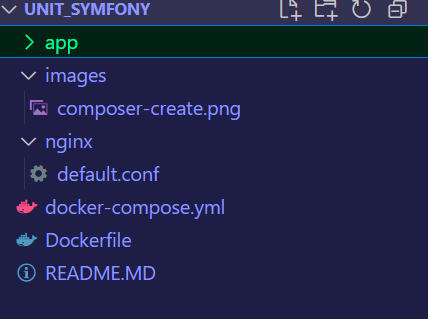
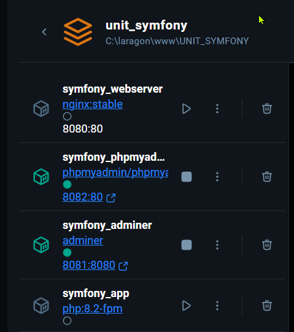
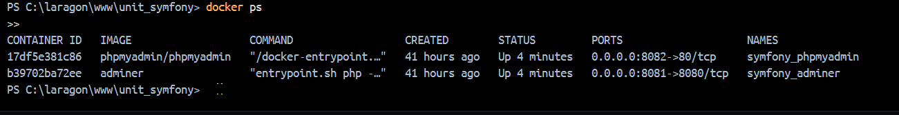
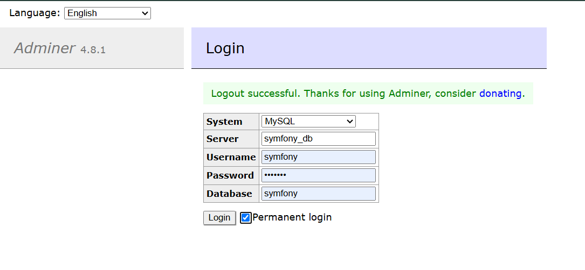
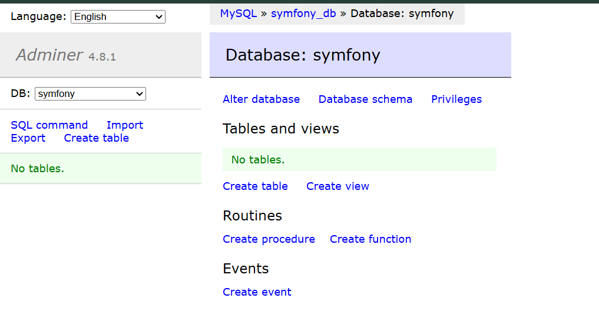
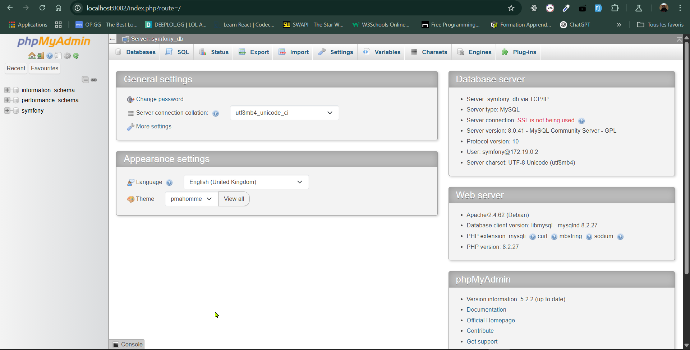
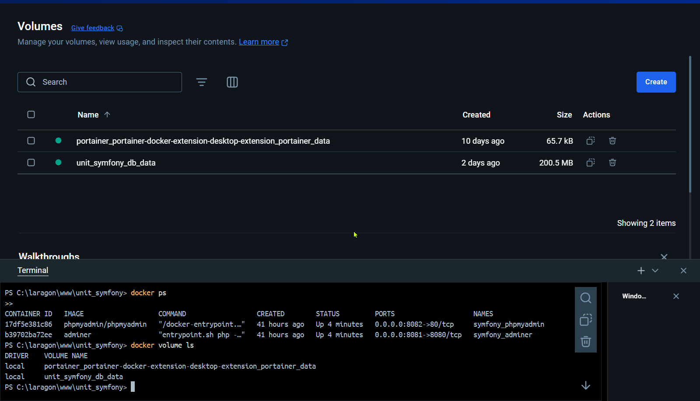
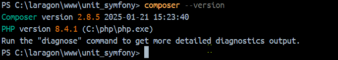

# Table des Matières

- [Table des Matières](#table-des-matières)
  - [1. Configuration des Services (docker-compose.yml)](#1-configuration-des-services-docker-composeyml)
    - [Service **app** (Application Symfony)](#service-app-application-symfony)
    - [Service **webserver** (Serveur Web Nginx)](#service-webserver-serveur-web-nginx)
    - [Service **database** (Base de données MySQL)](#service-database-base-de-données-mysql)
  - [](#)
    - [Service **adminer** (Interface de gestion de base de données légère)](#service-adminer-interface-de-gestion-de-base-de-données-légère)
  - [](#-1)
    - [Service **phpmyadmin** (Interface de gestion MySQL)](#service-phpmyadmin-interface-de-gestion-mysql)
  - [](#-2)
  - [2. Réseaux et Volumes](#2-réseaux-et-volumes)
    - [Réseaux](#réseaux)
    - [Volumes](#volumes)
  - [](#-3)
  - [3. Explication du Dockerfile](#3-explication-du-dockerfile)
    - [Ligne par ligne](#ligne-par-ligne)
  - [4. Explication du fichier `default.conf`](#4-explication-du-fichier-defaultconf)

---

## 1. Configuration des Services (docker-compose.yml)

### Service **app** (Application Symfony)

- **image:** `php:8.2-fpm`  
  Utilise l'image officielle PHP en version 8.2 configurée avec FPM (FastCGI Process Manager) pour exécuter les scripts PHP.

- **container_name:** `symfony_app`  
  Définit le nom du conteneur pour une identification facile.

- **working_dir:** `/var/www/html`  
  Spécifie le répertoire de travail par défaut dans le conteneur où sera exécutée l’application.

- **volumes:**  
  - `./app:/var/www/html`  
    Monte le dossier local `app` dans le conteneur, permettant ainsi la synchronisation du code entre l'hôte et le conteneur.

- **networks:**  
  - `symfony_network`  
    Place ce service sur le réseau personnalisé nommé `symfony_network`.

> 
---

### Service **webserver** (Serveur Web Nginx)

- **image:** `nginx:stable`  
  Utilise l'image officielle de Nginx en version stable.

- **container_name:** `symfony_webserver`  
  Définit le nom du conteneur pour le serveur web.

- **ports:**  
  - `"8080:80"`  
    Mappe le port 80 du conteneur sur le port 8080 de l'hôte, permettant d'accéder à l'application via [http://localhost:8080](http://localhost:8080).

- **volumes:**  
  - `./app:/var/www/html`  
    Monte le dossier local contenant l'application dans le conteneur.  
  - `./nginx:/etc/nginx/conf.d`  
    Monte le dossier local `nginx` (contenant la configuration de Nginx) dans le répertoire de configuration du conteneur.

- **depends_on:**  
  - `app`  
    Indique que le service `webserver` démarre après le service `app`.

- **networks:**  
  - `symfony_network`  
    Place ce service sur le réseau personnalisé `symfony_network`.



---

### Service **database** (Base de données MySQL)

- **image:** `mysql:8.0`  
  Utilise l'image officielle MySQL en version 8.0.

- **container_name:** `symfony_db`  
  Nom du conteneur pour la base de données.

- **environment:**  
  Définit les variables d'environnement pour configurer MySQL :  
  - `PMA_HOST: symfony_db`  
    Utilisé par des outils comme Adminer pour pointer vers ce conteneur.  
  - `MYSQL_ROOT_PASSWORD: root`  
    Définit le mot de passe du compte root.  
  - `MYSQL_DATABASE: symfony`  
    Crée une base de données nommée `symfony`.  
  - `MYSQL_USER: symfony` et `MYSQL_PASSWORD: symfony`  
    Crée un utilisateur nommé `symfony` avec le mot de passe `symfony`.

- **ports:**  
  - `"3306:3306"`  
    Mappe le port 3306 (port MySQL par défaut) du conteneur sur le même port de l'hôte.

- **volumes:**  
  - `db_data:/var/lib/mysql`  
    Monte le volume nommé `db_data` dans le dossier de stockage des données de MySQL pour garantir la persistance des données.

- **networks:**  
  - `symfony_network`  
    Place ce service sur le réseau personnalisé `symfony_network`.


---

### Service **adminer** (Interface de gestion de base de données légère)

- **image:** `adminer`  
  Utilise l'image officielle d'Adminer, une interface web simple pour gérer la base de données.

- **container_name:** `symfony_adminer`  
  Nom du conteneur pour Adminer.

- **restart:** `always`  
  Configure le conteneur pour qu'il redémarre automatiquement en cas de problème.

- **ports:**  
  - `"8081:8080"`  
    Mappe le port 8080 du conteneur sur le port 8081 de l'hôte. Adminer sera accessible via [http://localhost:8081](http://localhost:8081).

- **depends_on:**  
  - `database`  
    Assure que le service Adminer démarre après celui de la base de données.

- **networks:**  
  - `symfony_network`  
    Place ce service sur le réseau personnalisé `symfony_network`.

> **Capture d'écran suggérée :**  


---

### Service **phpmyadmin** (Interface de gestion MySQL)

- **image:** `phpmyadmin/phpmyadmin`  
  Utilise l'image officielle de phpMyAdmin.

- **container_name:** `symfony_phpmyadmin`  
  Nom du conteneur pour phpMyAdmin.

- **restart:** `always`  
  Permet de redémarrer le conteneur automatiquement si nécessaire.

- **ports:**  
  - `"8082:80"`  
    Mappe le port 80 du conteneur sur le port 8082 de l'hôte. PhpMyAdmin sera accessible via [http://localhost:8082](http://localhost:8082).

- **environment:**  
  Variables d'environnement pour configurer phpMyAdmin :  
  - `PMA_HOST: symfony_db`  
    Indique l'hôte de la base de données.  
  - `MYSQL_ROOT_PASSWORD: root`  
    Utilise le mot de passe root défini précédemment.  
  - `PMA_PMADB: phpmyadmin`  
    Nom de la base de données utilisée par phpMyAdmin.  
  - `PMA_CONTROLUSER: symfony` et `PMA_CONTROLPASS: symfony`  
    Identifiants pour le contrôle.

- **depends_on:**  
  - `database`  
    Garantit que le service phpMyAdmin démarre après la base de données.

- **networks:**  
  - `symfony_network`  
    Place ce service sur le réseau personnalisé `symfony_network`.


---

## 2. Réseaux et Volumes

### Réseaux

- **networks:**  
  - **symfony_network:**  
    Crée un réseau nommé `symfony_network` qui permet aux différents conteneurs de communiquer entre eux.  
  - **driver: bridge**  
    Spécifie l'utilisation du driver `bridge`, le mode de réseau par défaut dans Docker.

### Volumes

- **volumes:**  
  - **db_data:**  
    Déclare un volume nommé `db_data` utilisé pour stocker les données de MySQL de façon persistante.  
  - **phpmyadmin_data:**  
    Déclare un volume nommé `phpmyadmin_data` (à utiliser si nécessaire pour phpMyAdmin).

  

---

## 3. Explication du Dockerfile

### Ligne par ligne

- **`FROM php:8.2-fpm`**  
  Utilise l'image officielle PHP version 8.2 configurée avec FPM (FastCGI Process Manager).  
  Cette base est idéale pour déployer des applications web PHP performantes.

- **`# Installer Composer`**  
  *Commentaire :* Indique que les commandes suivantes ont pour objectif d'installer Composer, l'outil de gestion de dépendances PHP.

- **`RUN apt-get update && apt-get install -y curl unzip git`**  
  Exécute une commande dans l'image pour :  
  - Mettre à jour l'index des paquets disponibles via `apt-get update`.  
  - Installer les paquets nécessaires (`curl`, `unzip` et `git`) avec l'option `-y` pour valider automatiquement l'installation.

- **`RUN curl -sS https://getcomposer.org/installer | php \`**  
  Télécharge silencieusement (`-sS`) le script d'installation de Composer depuis son site officiel et le passe à PHP pour exécution.  
  Le caractère `\` indique que la commande se poursuit sur la ligne suivante.

- **`&& mv composer.phar /usr/local/bin/composer`**  
  Après l'installation, déplace le fichier `composer.phar` dans le répertoire `/usr/local/bin/` en le renommant en `composer`, afin que Composer soit accessible globalement dans le conteneur.



 `composer --version`.

---

## 4. Explication du fichier `default.conf`

Ce fichier de configuration Nginx définit les règles de routage et de sécurité pour notre application Symfony.  
Voici une explication ligne par ligne :

```nginx
server {
  listen 80;
  server_name localhost;
  root /var/www/html/public;

  index index.php index.html;

  location / {
    try_files $uri /index.php$is_args$args;
  }

  location ~ \.php$ {
    include fastcgi_params;
    fastcgi_pass app:9000;
    fastcgi_index index.php;
    fastcgi_param SCRIPT_FILENAME $document_root$fastcgi_script_name;
  }

  location ~ /\.ht {
    deny all;
  }
}
```

Explication détaillée :

- Le bloc « server { … } » ouvre la configuration du serveur.
- La directive « listen 80; » configure le serveur pour écouter sur le port 80.
- « server_name localhost; » définit le nom du serveur.
- « root /var/www/html/public; » définit le répertoire racine où se trouve l’application Symfony.
- « index index.php index.html; » précise les fichiers par défaut à servir.
- Le bloc « location / { … } » tente de servir le fichier correspondant à l’URI ; sinon, il redirige vers index.php.
- Le bloc « location ~ \.php$ { … } » gère l’exécution des fichiers PHP en passant la requête au service « app » sur le port 9000.
- Enfin, « location ~ /\.ht { deny all; } » interdit l’accès aux fichiers cachés commençant par « .ht ».

```
